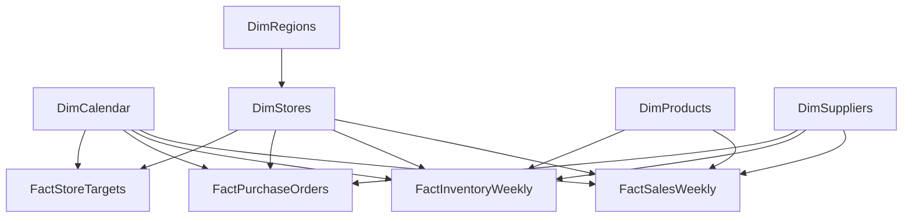

# Analytical data model

## Model design

Use conformed store, product, supplier and calendar dimensions with separate facts for weekly sales, tracked inventory, purchase orders and store targets. Filter relationships run from the one-side dimension to the many-side fact. Avoid direct fact-to-fact joins in Power BI and aggregate each fact to the required common grain before combining it in SQL.

| Table | Grain | Primary key | Relationship approach |
|---|---|---|---|
| `DimCalendar` | Calendar day | `DateKey` / `CalendarDate` | One calendar date filters the Monday week-start date stored on each fact. |
| `DimRegions` | Operating region | `RegionID` | One region filters its stores; avoid a second competing region path. |
| `DimStores` | Approved retail store | `StoreID` | One-to-many, single direction to all four facts. |
| `DimProducts` | Approved assortment product | `ProductID` | One-to-many, single direction to sales and tracked inventory. |
| `DimSuppliers` | Primary approved supplier | `SupplierID` | One-to-many, single direction to sales, inventory and purchase orders. |
| `FactSalesWeekly` | Store, product, week and sales-record type | `SalesRecordID` | Includes separately identified legitimate return adjustments. |
| `FactInventoryWeekly` | Tracked product, store and reporting week | `InventoryRecordID` | Weighted availability must sum demand before division. |
| `FactPurchaseOrders` | Individual supplier purchase order | `PurchaseOrderID` | Fill rate is weighted by ordered units. |
| `FactStoreTargets` | Store and reporting week | `TargetID` | Not allocated to product, category or supplier. |

## Modelling cautions

1. Sales and inventory share several dimensions, but neither fact should directly filter the other.
2. Product `SupplierID` is retained as descriptive lineage. Avoid activating a redundant supplier-to-product-to-fact route when supplier already directly filters the facts.
3. Calendar date should join to each fact's week-start column. The purchase-order join uses `OrderWeekStart`, not the actual received date.
4. A product category filter cannot legitimately subdivide a store sales target. `Sales Target (Aligned Scope)` therefore returns blank in an incompatible product-level context.
5. Inventory covers tracked products only. Do not compare tracked availability against the entire sales assortment without labelling that difference.
